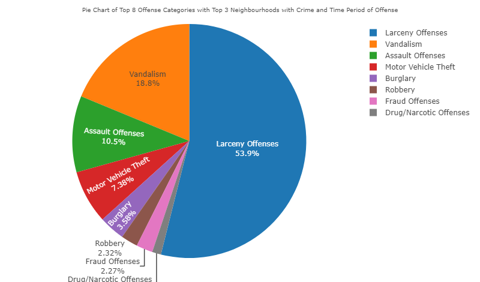
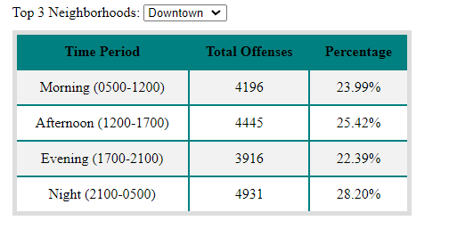
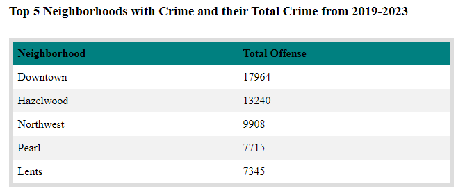

# Portland, Oregon Crime Rate Analysis from 2019 to 2023

The primary aim of the project is to analyze data and derive insights into the trends of crime rates in Portland, Oregon between 2019 and 2023. This analysis will be valuable for law enforcement to identify areas requiring enhanced patrolling and increased safety funding, as well as for the general public's awareness.

## Our team:
* Julia Liou
* Kevin Wan
* Yasir Ali Soomro
* Manpreet Sharma
* Penyaree Werning

## Programs Utilized:

### Backend 
* Python
* Flask
* SQLite
* SQL
* SQLAlchemy 

### Frontend
* HTML
* CSS
* JavaScript
* D3.js 
* Leaflet.js
* Plotly
* GeoJSON
* Chart.js 
### Other
* GitHub

## Dataset used:
* [Monthly Portland Neighborhood Offense Statistics by Portland Police Bureau from 2019 to 2023](https://public.tableau.com/app/profile/portlandpolicebureau/viz/New_Monthly_Neighborhood/MonthlyOffenseTotals) 

 ### CSV File found here: 
 * [Crime Data 2019](data/CrimeData-2019.csv)
 * [Crime Data 2020](data/CrimeData-2020.csv)
 * [Crime Data 2021](data/CrimeData-2021.csv)
 * [Crime Data 2022](data/CrimeData-2022.csv)
 * [Crime Data 2023](data/CrimeData-2023.csv)

## To run the app:

* Git clone- https://github.com/jnliou/project3.git 
* cd into directory- project3
* Start Flask app with [app.py](app.py)
* Run [index.html](index.html) to view the dashboard in a browser

## Data Cleaning and Processing 

### Data Cleaning CSV files for Analysis: 
* [CSV file used for analysis](<data/updated-Datafile-Crime3 (Final).zip>)
* [Jupyter Notebook Code for ETL](<ETL of the data.ipynb>)

Data cleaning and wrangling were fundamental steps in preparing raw data for meaningful analysis. For the challenge 3, our group selected crime data from Portland Oregon police website and the process of cleaning and wrangling five-year data files from 2019 to 2023 was done.

**Step 1: Data Collection and Assessment**
We Begin by gathering the data files for each year from 2019 to 2023. Assess the format, structure, and quality of the data. Ensure that the data files have consistent column names, data types, and formats.

**Step 2: Data Loading and Inspection**

We used Python to load and inspect the data. Import necessary libraries such as Pandas, numpy and matplotlib and read the data files into one Data Frame.

**Step 3: Data Cleaning**
Once all the five excel files were merged into one dataframe, Data cleaning involved identifying and addressing issues such as missing values, duplicates, and inconsistencies. We applied the following cleaning techniques:
•	Handle Missing Values.
•	Remove Duplicates number of crime cases.
•	Standardize Column Names
•	Dropping unwanted columns such as Address, Lat X, Lat Y and Offense Type.

**Step 4: Data Transformation**
After cleaning, we transformed the data to make it suitable for our analysis and visualization purpose. This involved the following:
•	Converting data types such as Date format into H:M:S from timestamp, 
•	Creating new column of Year from crime date reported, another column for Day categorization into Morning, Afternoon, Evening and Night from time column data., and aggregating information.

**Step 5: Data Integration**
Once we had consistent structures of data, we integrated it into a single DataFrame.

**Step 6: Data Export**

•	After cleaning and transforming the data, we exported it to a CSV file, JSON for further analysis into PostgreSQL.
•	Finally, we imported the CSV file onto SQLite to do further perform queries and create specific tables for analysis and data visualizations. We created 4 tables which included: a table for a pie chart, stacked bar chart, line chart, and map. 

## FLASK 

We utilized SQLAlchemy and Flask to create API routes in JSON format for each chart/table, the routes were named as followed:
* /api/v1.0/pie
* /api/v1.0/map
* /api/v1.0/line
* /api/v1.0/bar
* /api/v1.0/total
* /api/v1.0/neighborhood

## Data Analysis 

### Mapping

*  Converting files into geojson format, was able to get all the coordinates to reflect the type of crimes that have been committed at the Location/Neighborhood.
*  Map contains 3 layers, one with default OpenStreetMap, following with 2 maps from google. (Satellite vs Google map) 
*  Map includes a legend, color changes as the total number of crimes are being committed at the spot.
*  Using cluster and mapkey addon to better visualize.
*  We use logic.js to plot
*  Here is a link to the addons :
*  https://github.com/mapshakers/leaflet-mapkey-icon
*  https://github.com/Leaflet/Leaflet.markercluster

### Line Chart

In the dataset we used for this project, we were looking at 3 major categories of crime and who they were committed against - Person, Property and Society. 
* This visualization, helps the user understand the trends that can be observed over the last 5 years in these 3 major categories.
* The chart also includes a dropdown for the user so they can choose and analyze the trends for each category for a better understanding.
* Each category is then split into various sub-categories, the chart allows the user to see not only the overall trends for a particular category but also the number of offenses that occurrred in each category.
* We used Chart.js to plot.

Analysis of Trends: 

* The data was broadly split into three categories in terms of who these crimes were committed against – Person, Property and Society.
* It was quite interesting to note that the besides Property the other categories had a downward trend in terms of offenses that were being committed.
* All offenses under Property had a constant rise, larceny being the highest.
  
### Pie Chart and Tables

* We plotted an interactive pie chart using Plotly to analyze the number of crime and percentage of crime in the top 8 offense categories ('Larceny Offenses', 'Vandalism', 'Motor Vehicle Theft', 'Burglary', 'Assault Offenses', 'Fraud Offenses', 'Robbery', 'Drug/Narcotic Offenses'). 
* There were two drop down menus within the pie chart which looked at the time period of the crime occurence (morning, afternoon, evening, and night), and the neighbourhoods where the crime occurred ('Downtown', 'Hazelwood', 'Northwest'). The specific neighbourhoods were selected as they happened to be the top 3 neighbourhoods that had the most crime in Portland, OR. 

* We also plotted a pivot table that looked at number and percentage of crimes compared to the time (morning, afternoon, evening, and night) to get a better understanding of when the most crimes occurred. There was a drop down menu that can switch between the top 3 neighbourhoods with the most crime, so the tables specifically had information for the 3 neighbourhoods. D3 was utilized to create this pivot table. 

* We plotted another table using D3 that showed the top 5 neighbourhoods with the most crime, and the total crime count from 2019 to 2023. 

Analysis of Trends:
* Downtown Crime Epicenter: Highest reported crimes of 17964 within the last 5 years.
* Time Period: Based on the top 3 neighborhoods with the most crime, larceny is most likely to occur during the afternoon and evenings.
* More crimes occurred at night in Downtown and Northwest, but more crimes occurred in the afternoon in Hazelwood.

### Bar Chart 
Bar Chart presents an analysis of crime trends over the past five years, focusing on top five major categories: larceny, vandalism, motor theft, burglary, and Assualt offences. We used a bar chart to visualize these trends and understand how these crime categories have evolved over time.There is drop down menu for the top five crime categories, the x-axis represents the years, and the y-axis represents the number of reported incidents for each crime category.

Analysis of Trends:

* In the year 2019, larceny was already showing a higher number of incidents compared to vandalism and motor theft.
* Over the next few years, larceny consistently maintained its lead as the most reported crime category.
* Vandalism and motor theft, while also showing fluctuations, remained consistently lower in comparison to larceny.

##### Presentation

* Presentation of Crime Analysis found here: https://docs.google.com/presentation/d/1Xkok__gCio5lIMTB3KzMKNfvRM9XmUvSeEJECOl197k/edit#slide=id.g276564ff1ea_0_0 

